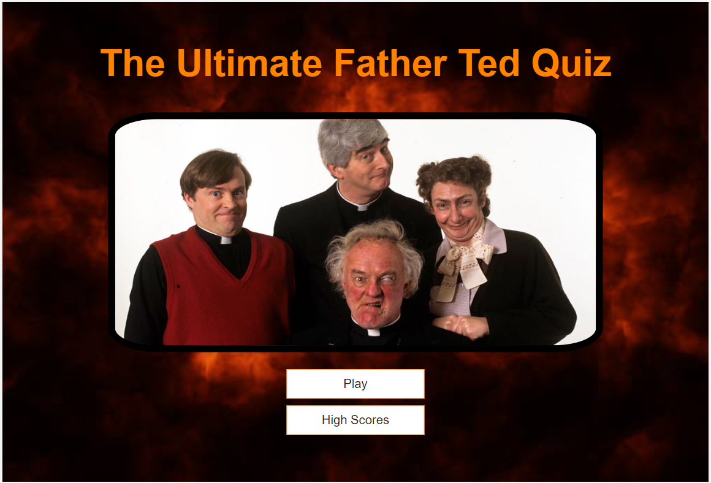
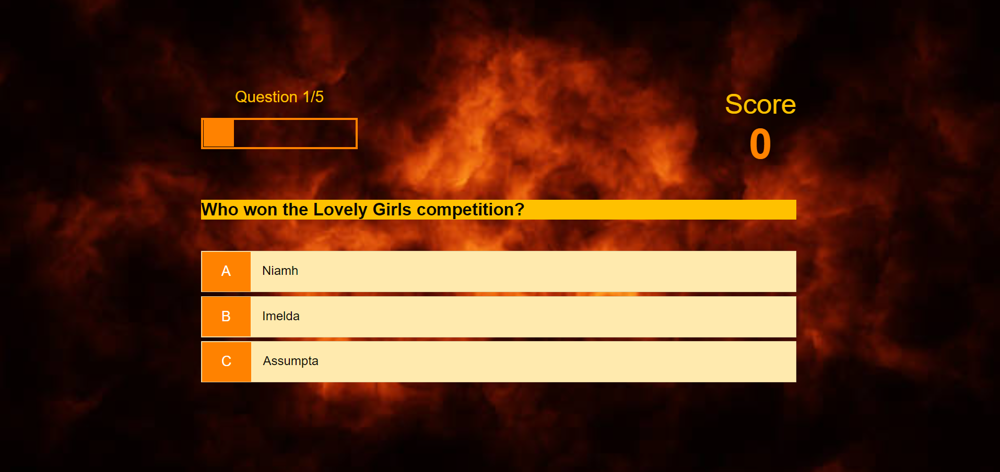
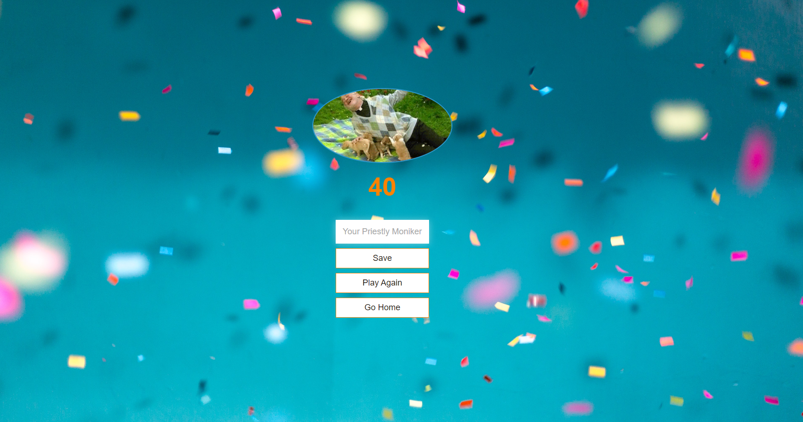
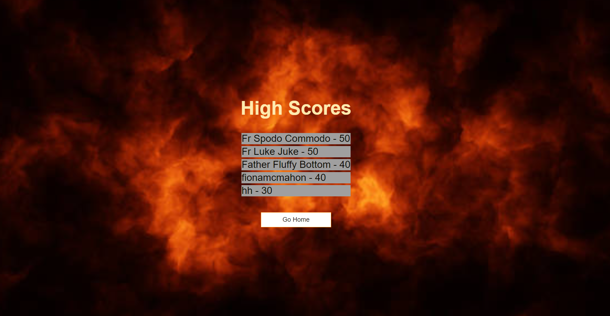

# Fr_Tedquiz
A simple quiz game about the TV show Father Ted using HTML,CSS &amp; JavaScript

The live website can be found at [Father Ted Quiz](https://fimcmahon.github.io/Fr_Tedquiz/)

# Contents

* [Description](https://github.com/FiMcMahon/Fr_Tedquiz/blob/c38d384d6b4210a99d68bb37094e2943f7670de1/README.md#L17)
* [Theme](https://github.com/FiMcMahon/Fr_Tedquiz/blob/main/README.md#L21)
* [Features](https://github.com/FiMcMahon/Fr_Tedquiz/blob/main/README.md#L29)
* [Testing](https://github.com/FiMcMahon/Fr_Tedquiz/blob/main/README.md#L55)
* [Technologies](https://github.com/FiMcMahon/Fr_Tedquiz/blob/main/README.md#L82)
* [Deployment](https://github.com/FiMcMahon/Fr_Tedquiz/blob/main/README.md#L98)
* [Acknowledgements](https://github.com/FiMcMahon/Fr_Tedquiz/blob/main/README.md#L105)

## Description
This project was designed to be fun.The information provided is basic, the quiz questions will give a user who is familiar with the TV show Father Ted, and those who are not, a fun way to learn some trivia about the show.

## Theme
The theme chosen for this project was based on TV Show Father Ted. An irreverent comedy about Irish priests. The background was chosen to represent 'fire and brimstone'. The colours chosen were simple to compliment this background and the hero image on the landing page.

* #FF8200
* #0A0903
* #FFC100
* black

## Features

### Homepage

The home page features an image of the characters in the show, and buttons to either begin the quiz or view the quizes highscores.

### Quiz Page

The quiz window gives you the option of multiple choice answers to a question related to the TV show. Correctly answered questions will highlight in green, incorrectly answered questions will highlight in red. A progress bar at the top left of the screen shows the user how many questions are left. A score increments on the top right of the screen depending on correctly or incorrectly answered questions.

### End Page

The end page features an image of a characters in the show celebrating; buttons to save your nickname and score and to either play again or go back home.

### Highscores Page 

The highscores page features a list of the top 5 highest scores in order, the nickname of the player as well as a button to return home.

### Future Features 
In the future I would work on the UI design as this is very simplistic and not optimal.
I would also add social media sharing tags.

## Testing

### Manual Testing
This was undertaken by myself. I tested all links to confirm they worked and went where they were supposed to. I used Chrome Dev Tools to inspect and confirm the site worked as it should and it displayed correctly across different screen sizes and browsers.

### Online Testing
All code was run through a validator and returned zero errors. These validator sites were:
* [Jigsaw CSS validator](https://jigsaw.w3.org/css-validator/#validate_by_uri)
* [W3C HTML Validator](https://validator.w3.org/)
* [JSHint JavaScript validator](https://jshint.com/)

Screenshots of all these results can be found below. All the warnings about unused variables can be ignored as these variables are used in other files.

![JShint]
(/assets/readme_images/endjs.PNG) 
(/assets/readme_images/gamejs.PNG)
(/assets/readme_images/highscoresjs.PNG)

### Responsivity Testing
This website allowed me to select a number of devices with different size screens and viewports and see how my website looked on each of them.
* [Responsive Checker](https://responsivechecker.net/responsive)

#### Google Lighthouse

## Technologies

* [HTML](https://devdocs.io/html/)
* [CSS](https://www.w3.org/Style/CSS/Overview.en.html)
* [JavaScript](https://developer.mozilla.org/en-US/docs/Web/javascript)
* [GitHub](https://github.com/)
* [GitPod](https://www.gitpod.io/docs/)
* [Markdown](https://markdown-guide.readthedocs.io/en/latest/)
* [Google Fonts](https://fonts.google.com/)

### Resources
* [Code Institute Curriculum](https://codeinstitute.net/)
* [YouTube](https://www.youtube.com/watch?v=u98ROZjBWy8) - Build a Quiz App by James Q Quick
* [W3Schools.com](https://www.w3schools.com/)
* [MDN Web Docs](https://developer.mozilla.org/en-US/)
 
## Deployment

This project was deployed using GitHub pages.
* Inside the repository click on the button marked "Settings".
* In the side bar on the left click on the button marked "Pages".
* Under the source title you have two drop down menus, make sure the first is set to "Main" and the second to "Root" and click "Save".
* Link to site appears after a few moments. 

## Acknowledgements

This quiz was executed and completed as a portfolio 2 Project for Diploma in Software Development (E-commerce Applications) at Code Institute. I would like to thank my mentor, Harry Dhillon for his patience and guidance as well as all the students in the wider Code Institute Slack channels.

